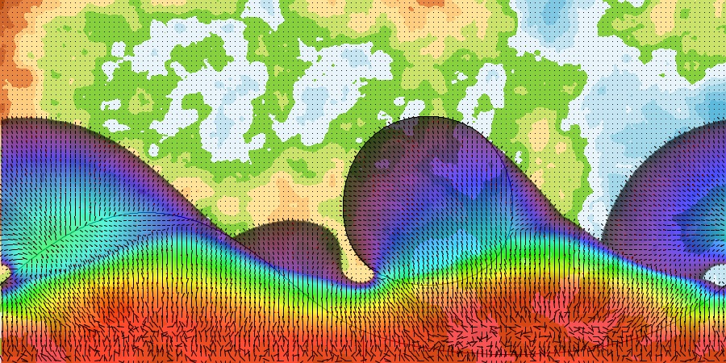

# Sun and wind map
----
## Context

With a group of people, I created a fantasy universe in which a planet is orbited by two stars.
Those stars have a circular orbit close to the planet. Their orbits are tilted in a way that their northernmost points are aligned with the equator and their southernmost points are aligned with the south pole.
The positions of the stars are opposed, when one is at the equator, the other is at the south pole.
The stars' influence on the planet is difficult to grasps so I created a program to get an idea of the temperatures and winds on the planet.

## Program description

This program takes a file of coordinates generated by the planetary system project as an input.
The coordinates are used to draw the areas lighted by the stars throughout the day. From that information, it calculates the temperatures (sunniest equal hottest) and the winds (considering that they are going from hot to cold). 

Activating the mode "dailyTemperatures" allow you to see a list of data for a specific location.
Those data are:
* The hours of sunshine centred at 12 AM
* The temperatures throughout the day (values are not representatives)

